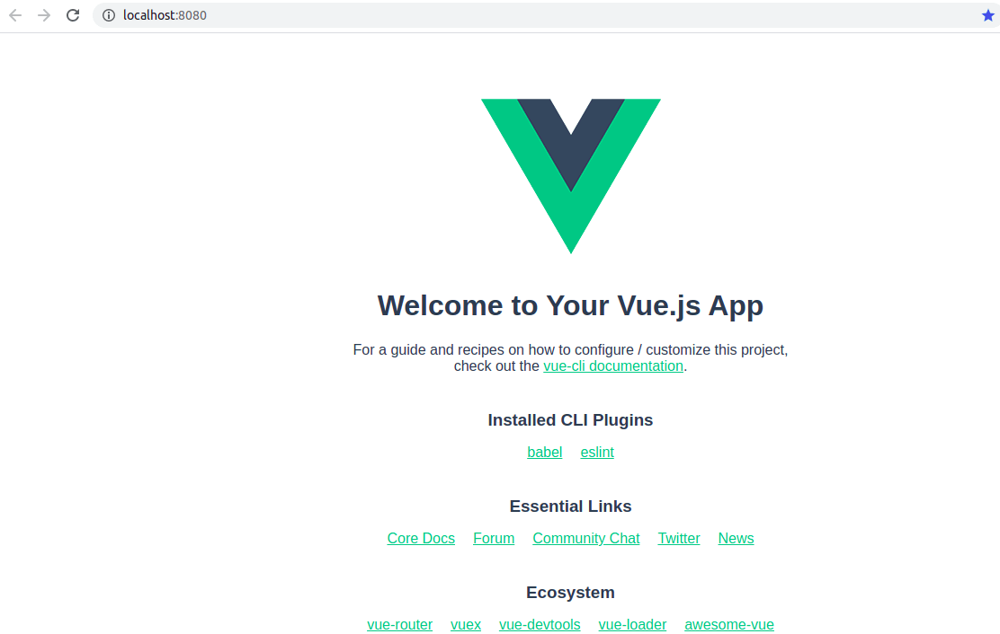

# 1.2 前端项目初始化

## 安装 npm

[npm](https://www.npmjs.com/) 是什么？npm 的全称是 Node Package Manager（Node 包管理器）。类似于后端的 pip。

为什么使用 npm？请查看文章：[npm 是干什么的？（非教程）](https://zhuanlan.zhihu.com/p/24357770)。

怎么安装 npm？因为 npm 是内置在 Node.js 里面的，所以，一般来说，安装了  [Node.js](https://nodejs.org/en/download/)，那么我们就可以使用 Node.js 了。下面是 Ubuntu 系统安装 npm 示范（Ubuntu 系统就是那个不一般的情况，Node.js 和 npm 需要分开安装）：

安装：

~:

```
$ sudo apt install nodejs npm
```

验证安装是否成功：

~:

```
$ node -v
v12.18.2
$ npm -v
6.14.8
```

## 安装 Vue CLI

[Vue CLI](https://cli.vuejs.org/guide/) 是什么？这里引用官方的定义：`Vue CLI is a full system for rapid Vue.js development`。

为什么使用 Vue CLI？为了开发更快速，如直接初始化项目。

怎么安装 Vue CLI？使用 npm 进行安装，具体可以参考官方文档：[Installation](https://cli.vuejs.org/guide/installation.html)。下面是 Ubuntu 系统安装 Vue CLI 示范：

安装：

~:

```
$ sudo npm install -g @vue/cli
```

（1）`-g` ：`--global`，表示全局安装。

（2）因为使用的是 -g 选项进行安装，所以 npm 将 Vue CLI 安装到了 `/usr/local/lib/node_modules`。

（3）npm 所有命令详见 [npm CLI commands](https://docs.npmjs.com/cli/v7/commands)，或者使用 `npm --help` 查看。

验证安装是否成功：

~:

```
$ vue --version
@vue/cli 4.5.13
```

## 创建 frontend

安装完 npm 和 Vue CLI 之后，便可以在项目根目录( flask-vue-blog )下面创建前端项目了。前端项目名为 frontend，根据 Vue CLI 官方文档的说明 [Creating a Project](https://cli.vuejs.org/guide/creating-a-project.html#vue-create)，使用 `vue create` 命令创建。

flask-vue-blog/：

```
$ vue create frontend
```

说明：

（1）执行上述命令后，会有一些选项让用户填写或者选择，这里全部按 `Enter` 键完成。

flask-vue-blog/frontend/：

```
/frontend/
├── babel.config.js
├── node_modules/
├── package.json
├── package-lock.json
├── public/
├── README.md
└── src/
```

说明：

（1）`node_modules/`，`public/`，`src/` 三个以 /  结尾的名字表示目录。

## 启动 frontend

项目已经创建完毕，接着我们就可以启动前端项目了。根据 Vue CLI 的官方文档  [CLI Service](https://cli.vuejs.org/guide/cli-service.html#using-the-binary)，运行前端项目需要先进入到前端项目里面，然后执行 `npm run serve` 命令。

flask-vue-blog/front-end：

```
$ npm run serve
```

启动后访问：http://localhost:8080/，如果出现如下所示的页面，说明前端项目初始化成功：




### npm run serve

要启动项目，我们使用 `npm run serve` ，那这背后具体做了什么呢？

（1）`run` 是 [run-script](https://docs.npmjs.com/cli/v7/commands/npm-run-script) 的别名，`serve` 是一个命令。所以  `npm run serve`  的意思是运行 `serve` 命令。那 `serve` 命令又是在哪里定义的呢？在 `flask-vue-blog/front-end/package.json` 文件里面，使用 `scripts` 对象里面定义。

flask-vue-blog/front-end/package.json：

```
"scripts": {
    "serve": "vue-cli-service serve",
    "build": "vue-cli-service build",
    "lint": "vue-cli-service lint"
  },
```

（2）`vue-cli-service` 又是什么呢？`vue-cli-service` 是一个可执行命令（即二进制可执行文件），即 `./node_modules/.bin/vue-cli-service`。所以执行 `npm run serve`  就等同于执行 `vue-cli-service` 。

flask-vue-blog/front-end/：

```
$ npm run serve
# 等同于执行
$ ./node_modules/.bin/vue-cli-service serve
```


## 参考资料

[1] npm CLI 文档： https://docs.npmjs.com/cli/v7

[2] 阮一峰，《npm scripts 使用指南》：https://www.ruanyifeng.com/blog/2016/10/npm_scripts.html

